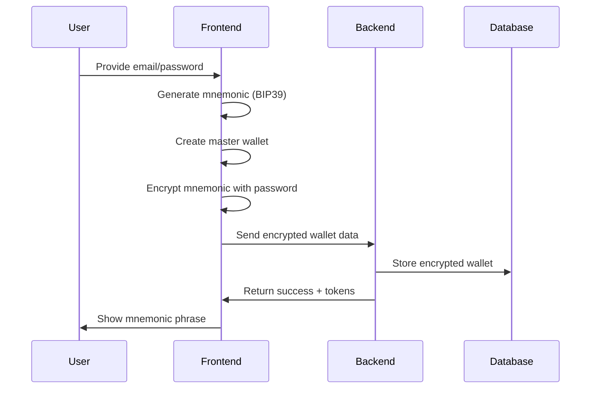

# Wallet Architecture Overview

## System Design Philosophy

The Rhizome wallet system is designed around the principle of **user-controlled identity with server-mediated blockchain interactions**. This hybrid approach provides:

1. **User Sovereignty**: Users control their own private keys
2. **Simplified UX**: No need for external wallet browser extensions
3. **Gasless Operations**: Server handles all transaction costs
4. **Multi-Profile Support**: Single wallet generates multiple identities

## Architecture Components

### 1. Frontend Wallet Management (`/front/src/utils/crypto.js`)

The frontend is responsible for:
- **Wallet Generation**: Creating BIP39 mnemonic phrases
- **Key Derivation**: Deriving child wallets for profiles using BIP44 paths
- **Client-Side Encryption**: Encrypting mnemonics with user passwords
- **Message Signing**: Signing messages for authentication and project participation

**Key Functions:**
- `generateWallet(password)` - Creates new wallet with mnemonic
- `deriveWallet(mnemonic, index)` - Derives child wallet for profiles
- `encrypt(mnemonic, password)` - Encrypts mnemonic using PBKDF2 + AES-GCM
- `signMessage(mnemonic, profileIndex, message)` - Signs messages with derived keys

### 2. Backend Wallet Storage (`/backend/src/services/auth.service.js`)

The backend handles:
- **Secure Storage**: Encrypted wallet data in PostgreSQL
- **User Authentication**: Wallet-based identity verification
- **Access Control**: Restricting wallet access to authenticated users

**Database Schema (`public.wallet`):**
```sql
CREATE TABLE public.wallet (
    id text NOT NULL,                    -- Ethereum address (0x...)
    user_id uuid NOT NULL,               -- User reference
    encrypted_private_key text NOT NULL, -- Encrypted mnemonic
    public_key text NOT NULL,            -- Public key
    created_at timestamp with time zone DEFAULT CURRENT_TIMESTAMP
);
```

### 3. Blockchain Service (`/backend/src/services/blockchain.service.js`)

The blockchain service:
- **Admin Wallet**: Uses server-controlled wallet for all transactions
- **Contract Interactions**: Handles NFT minting and project registration
- **Gas Management**: Covers transaction costs for users

**Key Features:**
- Single admin wallet signs all transactions
- Users don't directly interact with blockchain
- All operations are gasless for end users

## Data Flow

### User Registration Flow



### Profile Creation Flow

```mnemonic
sequenceDiagram
    participant U as User
    participant F as Frontend
    participant B as Backend
    participant DB as Database
    
    U->>F: Create new profile
    F->>B: Fetch encrypted mnemonic
    B->>DB: Retrieve wallet data
    DB->>B: Return encrypted mnemonic
    B->>F: Send encrypted data
    F->>F: Decrypt with password
    F->>F: Derive child wallet (index++)
    F->>B: Send profile + derived address
    B->>DB: Store profile with address
```

### Message Signing Flow

```mermonic
sequenceDiagram
    participant U as User
    participant F as Frontend
    participant B as Backend
    
    U->>F: Sign project/message
    F->>F: Decrypt mnemonic
    F->>F: Derive profile wallet
    F->>F: Sign message with private key
    F->>B: Send signature
    B->>B: Verify signature
    B->>B: Store signature on-chain
```

## Key Design Decisions

### 1. HD Wallet Structure (BIP44)

**Path**: `m/44'/60'/0'/0/{profile_index}`
- `44'` - BIP44 standard
- `60'` - Ethereum coin type
- `0'` - Account (always 0)
- `0` - Change (always 0, external addresses)
- `{profile_index}` - Profile-specific index

**Benefits:**
- Single mnemonic supports unlimited profiles
- Deterministic address generation
- Standard compliance for wallet recovery

### 2. Password-Based Encryption

**Algorithm**: PBKDF2 + AES-GCM
- **Key Derivation**: 100,000 iterations of PBKDF2
- **Encryption**: AES-256-GCM with random IV
- **Salt**: Random 16-byte seed per wallet

**Security Features:**
- Password required for mnemonic access
- Unique salt prevents rainbow table attacks
- Authenticated encryption prevents tampering

### 3. Server-Side Transaction Signing

**Rationale:**
- Eliminates gas costs for users
- Simplifies user experience
- Maintains control over blockchain operations
- Reduces complexity of wallet integrations

**Trade-offs:**
- Centralized transaction authority
- Users cannot directly send transactions
- Requires trust in server operations

## Integration Points

### 1. Authentication System

Wallets are tightly integrated with user authentication:
- Wallet address serves as unique identifier
- Private key encrypted with user password
- Profile addresses derived from master wallet

### 2. Project Management

Each project participant has:
- Unique derived address for project identity
- Ability to sign project participation messages
- NFT address for project completion rewards

### 3. Profile System

Profile-wallet relationship:
- Each profile gets unique derived address
- Address stored in `profiles.derived_address`
- Public key stored in `profiles.derived_public_key`

## Performance Considerations

### 1. Client-Side Operations

**Expensive Operations:**
- Mnemonic encryption/decryption (PBKDF2)
- Key derivation (BIP44 paths)
- Message signing (ECDSA)

**Optimization Strategies:**
- Cache decrypted mnemonics in memory (session-only)
- Batch multiple signatures when possible
- Use web workers for heavy crypto operations

### 2. Server-Side Operations

**Database Queries:**
- Wallet data cached per user session
- Profile addresses indexed for fast lookup
- Minimal wallet table access patterns

**Blockchain Operations:**
- Admin wallet connection pooling
- Transaction batching for multiple operations
- Gas price optimization strategies