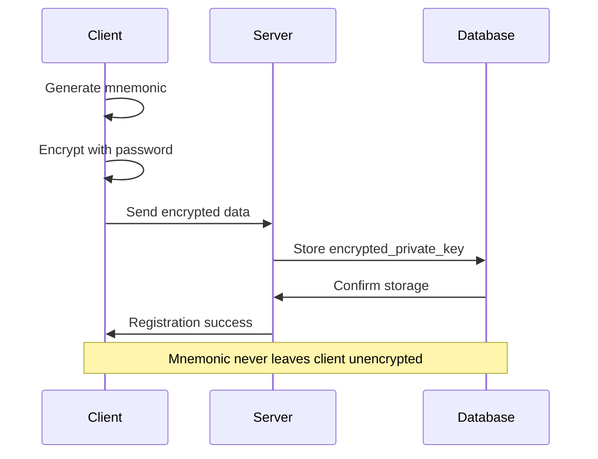

# Encryption & Storage Mechanisms

## Overview

The Rhizome wallet system implements client-side encryption of mnemonic phrases using industry-standard cryptographic algorithms. This ensures that sensitive wallet data is protected both in transit and at rest.

## Encryption Architecture

### Algorithm Stack

**Primary Encryption**: AES-256-GCM
- **Key Size**: 256 bits
- **Mode**: Galois/Counter Mode (GCM)
- **Authentication**: Built-in authenticated encryption
- **IV Size**: 96 bits (12 bytes)

**Key Derivation**: PBKDF2
- **Hash Function**: SHA-256
- **Iterations**: 100,000
- **Salt**: Random 16-byte seed per wallet
- **Key Length**: 256 bits

### Security Properties

1. **Confidentiality**: AES-256 encryption
2. **Integrity**: GCM authentication tag
3. **Authenticity**: Authenticated encryption prevents tampering
4. **Salt Uniqueness**: Random salt per wallet prevents rainbow table attacks
5. **Key Stretching**: PBKDF2 iterations slow down brute force attacks

## Encryption Implementation

### Encryption Process

**Location**: `front/src/utils/crypto.js:60`

```javascript
export const encrypt = async (mnemonic, password) => {
  // 1. Generate random salt (16 bytes)
  const seed = ethers.hexlify(ethers.randomBytes(16));
  
  // 2. Import password as key material
  const keyMaterial = await window.crypto.subtle.importKey(
    "raw",
    new TextEncoder().encode(password),
    { name: "PBKDF2" },
    false,
    ["deriveKey"]
  );
  
  // 3. Derive AES key using PBKDF2
  const key = await window.crypto.subtle.deriveKey(
    {
      name: "PBKDF2",
      salt: new TextEncoder().encode(seed),
      iterations: 100000,
      hash: "SHA-256",
    },
    keyMaterial,
    { name: "AES-GCM", length: 256 },
    false,
    ["encrypt"]
  );
  
  // 4. Generate random IV (12 bytes)
  const iv = window.crypto.getRandomValues(new Uint8Array(12));
  
  // 5. Encrypt mnemonic
  const encryptedData = await window.crypto.subtle.encrypt(
    { name: "AES-GCM", iv },
    key,
    new TextEncoder().encode(mnemonic)
  );
  
  // 6. Combine IV + Salt + Encrypted Data
  return (
    btoa(String.fromCharCode(...iv)) +
    "." +
    seed +
    "." +
    btoa(String.fromCharCode(...new Uint8Array(encryptedData)))
  );
};
```

### Decryption Process

**Location**: `front/src/utils/crypto.js:101`

```javascript
export const decrypt = async (encryptedData, password) => {
  // 1. Parse encrypted data format
  const parts = encryptedData.split(".");
  if (parts.length !== 3) throw new Error("Invalid format");
  
  // 2. Extract components
  const iv = new Uint8Array(
    atob(parts[0]).split("").map((c) => c.charCodeAt(0))
  );
  const seed = parts[1];
  const encryptedMnemonic = new Uint8Array(
    atob(parts[2]).split("").map((c) => c.charCodeAt(0))
  );
  
  // 3. Import password as key material
  const keyMaterial = await window.crypto.subtle.importKey(
    "raw",
    new TextEncoder().encode(password),
    { name: "PBKDF2" },
    false,
    ["deriveKey"]
  );
  
  // 4. Derive same AES key
  const key = await window.crypto.subtle.deriveKey(
    {
      name: "PBKDF2",
      salt: new TextEncoder().encode(seed),
      iterations: 100000,
      hash: "SHA-256",
    },
    keyMaterial,
    { name: "AES-GCM", length: 256 },
    false,
    ["decrypt"]
  );
  
  // 5. Decrypt mnemonic
  const decryptedData = await window.crypto.subtle.decrypt(
    { name: "AES-GCM", iv },
    key,
    encryptedMnemonic
  );
  
  // 6. Return decrypted mnemonic
  return new TextDecoder().decode(decryptedData);
};
```

## Encrypted Data Format

### Format Structure

```
[IV_BASE64].[SALT_HEX].[ENCRYPTED_MNEMONIC_BASE64]
```

### Example Breakdown

```
Input Mnemonic: "abandon abandon abandon abandon abandon abandon abandon abandon abandon abandon abandon about"
Password: "user-password-123"

Generated Components:
- IV: 12 random bytes (base64 encoded)
- Salt: 16 random bytes (hex encoded)
- Encrypted Data: AES-GCM output (base64 encoded)

Final Format:
"dGVzdGl2MTIzNDU2Nzg5MA==.0x1234567890abcdef1234567890abcdef.ZW5jcnlwdGVkbW5lbW9uaWNkYXRhMTIzNDU2Nzg5MA=="
```

### Component Details

1. **IV (Initialization Vector)**
   - Size: 12 bytes (96 bits)
   - Encoding: Base64
   - Purpose: Randomizes encryption for same plaintext

2. **Salt**
   - Size: 16 bytes (128 bits)
   - Encoding: Hexadecimal
   - Purpose: Prevents rainbow table attacks

3. **Encrypted Mnemonic**
   - Algorithm: AES-256-GCM
   - Encoding: Base64
   - Includes: Authentication tag

## Storage Architecture

### Database Schema

**Location**: `backend/database/01_init.sql:315`

```sql
CREATE TABLE public.wallet (
    id text NOT NULL,                    -- Ethereum address (0x...)
    user_id uuid NOT NULL,               -- User reference
    encrypted_private_key text NOT NULL, -- Encrypted mnemonic
    public_key text NOT NULL,            -- Public key
    created_at timestamp with time zone DEFAULT CURRENT_TIMESTAMP,
    CONSTRAINT wallet_id_check CHECK ((id ~ '^0x[0-9a-fA-F]{40}$'))
);
```

### Storage Flow



### Backend Storage Service

**Location**: `backend/src/services/auth.service.js`

```javascript
export const register = async (email, hashedPassword, wallet) => {
  // Insert user data
  const userResult = await pool.query(
    'INSERT INTO users (email, hashed_password) VALUES ($1, $2) RETURNING *',
    [email, hashedPassword]
  );
  
  // Insert wallet data
  await pool.query(
    'INSERT INTO wallet (id, user_id, encrypted_private_key, public_key) VALUES ($1, $2, $3, $4)',
    [wallet.id, userResult.rows[0].id, wallet.encrypted_private_key, wallet.public_key]
  );
  
  return userResult.rows[0];
};
```

## Security Considerations

### 1. Password-Based Security

**Strengths:**
- User controls encryption key
- Server cannot decrypt without password
- PBKDF2 slows brute force attacks

**Weaknesses:**
- Vulnerable to weak passwords
- Password required for wallet access
- No recovery without password

### 2. Client-Side Encryption

**Benefits:**
- Zero-knowledge architecture
- Server cannot access mnemonics
- End-to-end encryption

**Risks:**
- Client-side crypto implementation
- Browser security dependencies
- JavaScript execution environment

### 3. Storage Security

**Database Protection:**
- Encrypted data only in database
- No plaintext mnemonics stored
- User authentication required

**Network Security:**
- HTTPS encryption in transit
- No mnemonic transmission
- Encrypted payload only

## Error Handling

### Encryption Errors

```javascript
// Encryption failure
{
  success: false,
  message: "Encryption error",
  errorCode: "encrypt-error",
  errorKey: 123456
}
```

### Decryption Errors

```javascript
// Invalid format
{
  success: false,
  message: "Decryption error",
  errorCode: "invalid-format",
  errorKey: 698264
}

// Wrong password
{
  success: false,
  message: "Decryption error",
  errorCode: "decrypt-error",
  errorKey: 755536
}
```

### Common Error Scenarios

1. **Invalid Encrypted Data Format**: Malformed encrypted string
2. **Wrong Password**: Incorrect decryption key
3. **Corrupted Data**: Network or storage corruption
4. **Browser Compatibility**: Crypto API not available

## Performance Optimization

### 1. Caching Strategy

**Session-Level Caching:**
- Decrypt once per session
- Cache in memory (never persist)
- Clear on logout/session end

```javascript
// Session cache example
let cachedMnemonic = null;

const getDecryptedMnemonic = async (password) => {
  if (cachedMnemonic) return cachedMnemonic;
  
  const wallet = await getWallet();
  cachedMnemonic = await decrypt(wallet.encrypted_private_key, password);
  return cachedMnemonic;
};
```

### 2. Optimization Techniques

**Reduce Crypto Operations:**
- Batch multiple operations
- Cache derived wallets
- Minimize encryption/decryption calls

**Web Workers:**
- Move heavy crypto to workers
- Prevent UI blocking
- Parallel processing

### 3. Performance Metrics

**Typical Operations:**
- Encryption: ~100-200ms
- Decryption: ~100-200ms
- Key Derivation: ~50-100ms

**Optimization Targets:**
- First-time encryption: < 500ms
- Subsequent decryptions: < 100ms
- Profile derivation: < 50ms

## Compliance & Standards

### 1. Cryptographic Standards

**NIST Compliance:**
- AES-256: FIPS 197
- PBKDF2: NIST SP 800-132
- SHA-256: FIPS 180-4

**Industry Standards:**
- BIP39: Mnemonic phrases
- BIP44: HD wallet structure
- RFC 5869: HKDF key derivation

### 2. Security Best Practices

**Key Management:**
- Secure random generation
- Proper key derivation
- Safe key storage

**Encryption Implementation:**
- Authenticated encryption
- Secure padding
- IV randomization

## Testing & Validation

### Encryption Testing

```javascript
// Test encryption/decryption cycle
const testMnemonic = "test mnemonic phrase";
const testPassword = "test-password";

const encrypted = await encrypt(testMnemonic, testPassword);
const decrypted = await decrypt(encrypted, testPassword);

console.assert(decrypted === testMnemonic, "Encryption/decryption failed");
```

### Security Testing

```javascript
// Test with wrong password
try {
  await decrypt(encrypted, "wrong-password");
  console.error("Should have failed with wrong password");
} catch (error) {
  console.log("Correctly failed with wrong password");
}

// Test with corrupted data
try {
  await decrypt("corrupted.data.here", testPassword);
  console.error("Should have failed with corrupted data");
} catch (error) {
  console.log("Correctly failed with corrupted data");
}
```