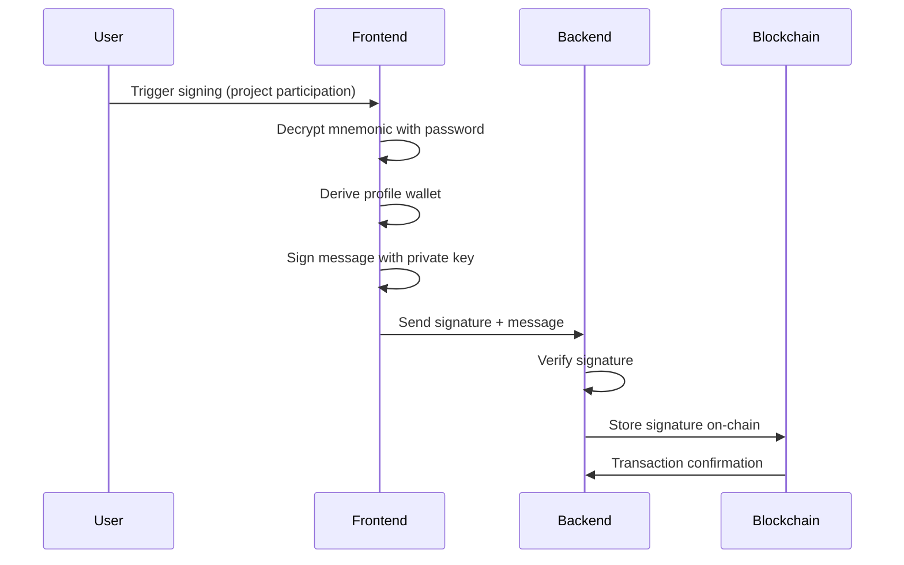

# Message Signing & Verification

## Overview

The Rhizome wallet system implements message signing for user authentication and project participation. Each user profile can sign messages using their derived private key, providing cryptographic proof of identity and consent.

## Message Signing Architecture

### Signing Process Flow



### Key Components

1. **Message Preparation**: Format data for signing
2. **Key Derivation**: Derive signing key for specific profile
3. **ECDSA Signing**: Generate cryptographic signature
4. **Signature Verification**: Validate signature authenticity
5. **On-Chain Storage**: Store signature for permanent record

## Signing Implementation

### Message Signing Function

**Location**: `front/src/utils/crypto.js:5`

```javascript
export const signMessage = async (mnemonic, profileIndex, message) => {
  try {
    // 1. Create HDNode from mnemonic with base path
    const hdNode = ethers.HDNodeWallet.fromPhrase(mnemonic, "m/44'/60'/0'/0");
    
    // 2. Derive profile wallet
    const profileWallet = hdNode.derivePath(`${profileIndex}`);
    
    // 3. Convert message to bytes if needed
    const hashBytes = ethers.getBytes(message);
    
    // 4. Sign message using profile's private key
    const signature = await profileWallet.signMessage(hashBytes);
    
    return signature;
  } catch (error) {
    return {
      success: false,
      message: "Signature error",
      fromError: error.message,
      errorCode: "sign-message-error",
      errorKey: 606855,
    };
  }
};
```

### Signature Verification

**Location**: `front/src/utils/crypto.js:42`

```javascript
export const verifySignature = (message, signature, expectedAddress) => {
  try {
    // 1. Recover signer address from message and signature
    const signerAddress = ethers.verifyMessage(message, signature);
    
    // 2. Compare with expected address
    return signerAddress === expectedAddress;
  } catch (error) {
    return {
      success: false,
      message: "Signature verification error",
      fromError: error.message,
      errorCode: "verify-signature-error",
      errorKey: 150177,
    };
  }
};
```

## Message Formats

### Project Participation Signing

**Message Structure:**
```javascript
const projectMessage = {
  projectId: "uuid-v4",
  participantAddress: "0x...",
  role: "contributor",
  timestamp: 1640995200,
  action: "participate"
};

// Convert to hash for signing
const messageHash = ethers.keccak256(
  ethers.toUtf8Bytes(JSON.stringify(projectMessage))
);
```

### Authentication Signing

**Message Structure:**
```javascript
const authMessage = {
  userId: "uuid-v4",
  profileId: "uuid-v4",
  timestamp: 1640995200,
  action: "authenticate"
};

const messageHash = ethers.keccak256(
  ethers.toUtf8Bytes(JSON.stringify(authMessage))
);
```

## Database Storage

### Project Participants Table

**Location**: `backend/database/01_init.sql:213`

```sql
CREATE TABLE public.project_participants (
    id uuid NOT NULL,
    project_id uuid NOT NULL,
    profile_id uuid NOT NULL,
    role_id integer NOT NULL,
    contribution integer DEFAULT 0 NOT NULL,
    contribution_description text,
    created_at timestamp with time zone DEFAULT CURRENT_TIMESTAMP,
    is_signed boolean DEFAULT false,      -- Signature status
    signature text,                       -- ECDSA signature
    signed_at timestamp with time zone,   -- Signature timestamp
    nft_address text,                     -- NFT contract address
    nft_token_id text,                    -- NFT token ID
    nft_token_uri text                    -- NFT metadata URI
);
```

### Signature Storage Process

```javascript
// Store signature in database
const storeSignature = async (participantId, signature, messageHash) => {
  await pool.query(`
    UPDATE project_participants 
    SET is_signed = true, 
        signature = $2, 
        signed_at = CURRENT_TIMESTAMP 
    WHERE id = $1
  `, [participantId, signature]);
};
```

## Cryptographic Details

### ECDSA Signature Algorithm

**Curve**: secp256k1 (same as Bitcoin/Ethereum)
**Hash Function**: Keccak-256
**Signature Format**: 65 bytes (r, s, v)

### Signature Components

1. **r**: 32 bytes - First part of signature
2. **s**: 32 bytes - Second part of signature  
3. **v**: 1 byte - Recovery ID (27 or 28)

### Ethereum Message Signing

**Ethereum Signed Message Prefix:**
```
"\x19Ethereum Signed Message:\n" + message.length + message
```

**Example:**
```javascript
const message = "Hello World";
const prefixedMessage = "\x19Ethereum Signed Message:\n11Hello World";
const hash = ethers.keccak256(ethers.toUtf8Bytes(prefixedMessage));
```

## Use Cases

### 1. Project Participation

**Flow:**
1. User clicks "Join Project"
2. Frontend prompts for password
3. Decrypt mnemonic with password
4. Derive profile wallet
5. Sign participation message
6. Send signature to backend
7. Backend verifies and stores signature
8. Smart contract updated with participation

**Message Content:**
```javascript
const participationMessage = {
  projectId: "proj-123",
  participantAddress: "0x742d35Cc6634C0532925a3b8D456ba",
  role: "contributor",
  timestamp: Date.now(),
  action: "participate"
};
```

### 2. Profile Authentication

**Flow:**
1. User logs in with profile
2. Frontend generates auth challenge
3. User signs challenge with profile key
4. Backend verifies signature matches profile
5. Issue authentication token

**Message Content:**
```javascript
const authChallenge = {
  userId: "user-123",
  profileId: "profile-456",
  nonce: "random-nonce-789",
  timestamp: Date.now(),
  action: "authenticate"
};
```

### 3. NFT Minting Authorization

**Flow:**
1. Project completion triggers NFT minting
2. Each participant signs minting authorization
3. Backend collects all signatures
4. Smart contract mints NFTs with signatures as proof

**Message Content:**
```javascript
const mintingAuth = {
  projectId: "proj-123",
  participantAddress: "0x742d35Cc6634C0532925a3b8D456ba",
  nftContract: "0x...",
  tokenId: "1",
  timestamp: Date.now(),
  action: "mint_nft"
};
```

## Security Considerations

### 1. Message Integrity

**Hash-Based Signing:**
- Messages hashed before signing
- Prevents signature malleability
- Ensures message authenticity

**Timestamp Validation:**
- Signatures include timestamps
- Prevents replay attacks
- Enforces temporal validity

### 2. Key Security

**Profile Isolation:**
- Each profile uses different private key
- Compromise of one profile doesn't affect others
- Separate signing contexts

**Mnemonic Protection:**
- Mnemonic decrypted only for signing
- Cleared from memory after use
- Never stored in plaintext

### 3. Verification Requirements

**Address Matching:**
- Signature must match expected address
- Prevents impersonation
- Validates profile ownership

**Message Validation:**
- Verify message format and content
- Check timestamp validity
- Validate signing context

## Error Handling

### Common Signing Errors

```javascript
// Invalid mnemonic
{
  success: false,
  message: "Signature error",
  errorCode: "invalid-mnemonic",
  errorKey: 606855
}

// Wrong password
{
  success: false,
  message: "Signature error", 
  errorCode: "decrypt-error",
  errorKey: 606856
}

// Invalid profile index
{
  success: false,
  message: "Signature error",
  errorCode: "invalid-profile-index",
  errorKey: 606857
}
```

### Verification Errors

```javascript
// Signature verification failed
{
  success: false,
  message: "Signature verification error",
  errorCode: "verify-signature-error",
  errorKey: 150177
}

// Address mismatch
{
  success: false,
  message: "Address mismatch",
  errorCode: "address-mismatch",
  errorKey: 150178
}
```

## Performance Optimization

### 1. Batch Signing

**Multiple Messages:**
- Sign multiple messages in single session
- Reuse decrypted mnemonic
- Reduce crypto operations

```javascript
const batchSign = async (mnemonic, profileIndex, messages) => {
  const hdNode = ethers.HDNodeWallet.fromPhrase(mnemonic, "m/44'/60'/0'/0");
  const profileWallet = hdNode.derivePath(`${profileIndex}`);
  
  const signatures = [];
  for (const message of messages) {
    const signature = await profileWallet.signMessage(message);
    signatures.push(signature);
  }
  
  return signatures;
};
```

### 2. Caching Strategy

**Session-Level Caching:**
- Cache derived wallets per session
- Avoid repeated derivation
- Clear on logout

```javascript
const derivedWallets = new Map();

const getCachedWallet = (mnemonic, profileIndex) => {
  const key = `${profileIndex}`;
  if (derivedWallets.has(key)) {
    return derivedWallets.get(key);
  }
  
  const hdNode = ethers.HDNodeWallet.fromPhrase(mnemonic, "m/44'/60'/0'/0");
  const wallet = hdNode.derivePath(`${profileIndex}`);
  derivedWallets.set(key, wallet);
  
  return wallet;
};
```

### 3. Async Operations

**Non-Blocking Signing:**
- Use Web Workers for heavy operations
- Async/await for better UX
- Progress indicators for long operations

## Testing & Validation

### Signing Test Cases

```javascript
// Test basic signing
const testMnemonic = "abandon abandon abandon abandon abandon abandon abandon abandon abandon abandon abandon about";
const testMessage = "test message";
const signature = await signMessage(testMnemonic, 1, testMessage);

// Test verification
const hdNode = ethers.HDNodeWallet.fromPhrase(testMnemonic, "m/44'/60'/0'/0");
const profileWallet = hdNode.derivePath("1");
const expectedAddress = profileWallet.address;

const isValid = verifySignature(testMessage, signature, expectedAddress);
console.assert(isValid, "Signature verification failed");
```

### Edge Case Testing

```javascript
// Test with invalid inputs
try {
  await signMessage("invalid mnemonic", 1, "message");
  console.error("Should have failed with invalid mnemonic");
} catch (error) {
  console.log("Correctly failed with invalid mnemonic");
}

// Test signature verification with wrong address
const wrongAddress = "0x0000000000000000000000000000000000000000";
const shouldFail = verifySignature(testMessage, signature, wrongAddress);
console.assert(!shouldFail, "Should have failed with wrong address");
```

## Integration Examples

### React Component Integration

```javascript
const SignProjectParticipation = ({ projectId, profileIndex }) => {
  const [signing, setSigning] = useState(false);
  const [signature, setSignature] = useState(null);
  
  const handleSign = async () => {
    setSigning(true);
    try {
      const password = await promptPassword();
      const mnemonic = await getDecryptedMnemonic(password);
      const message = createParticipationMessage(projectId);
      const sig = await signMessage(mnemonic, profileIndex, message);
      setSignature(sig);
    } catch (error) {
      console.error("Signing failed:", error);
    } finally {
      setSigning(false);
    }
  };
  
  return (
    <button onClick={handleSign} disabled={signing}>
      {signing ? "Signing..." : "Sign Participation"}
    </button>
  );
};
```